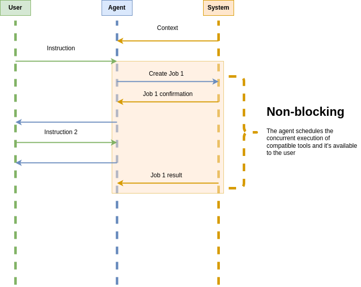

# `concurrent-agent-executor`



An concurrent runtime for tool-enhanced language agents.

## Getting Started

To install the library run:

```console
pip install .
```

To test an example set up a `.env` file with your `OPENAI_API_KEY`:

```plain
OPENAI_API_KEY = sk-(...)
```

Then, run:

```console
python examples/slow_random_number.py
```

## Contributing

```console
conda env create -f environment.yml
```
