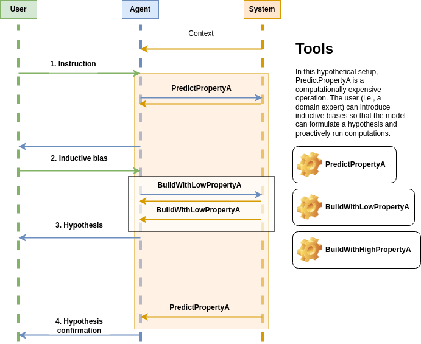
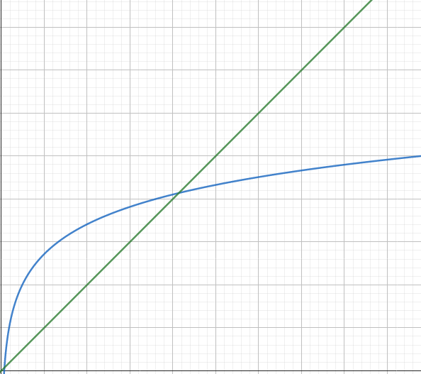

# `concurrent-agent-executor`


An concurrent runtime for tool-enhanced language agents.

## Getting Started

To install the library run:

```console
pip install .
```

To test an example set up a `.env` file with your `OPENAI_API_KEY`:

```plain
OPENAI_API_KEY = sk-(...)
```

Then, run:

```console
python examples/slow_random_number.py
```

## Contributing

```console
conda env create -f environment.yml
```

## Ideas

### [Branch prediction](https://en.wikipedia.org/wiki/Branch_predictor) and hypothesizing



### Concurrency overhead and theoretical performance



In this diagram, the `x-axis` represents the processsing steps needed to accomplish a task, and the `y-axis` represents the running time of the agent.

The green line shows the theorical running time with respect to the processing steps for the classic langchain agent (sequentially).

In contrast, the blue line represents the theoretical running time for the proposed concurrent agent runtime (proposed methods).
